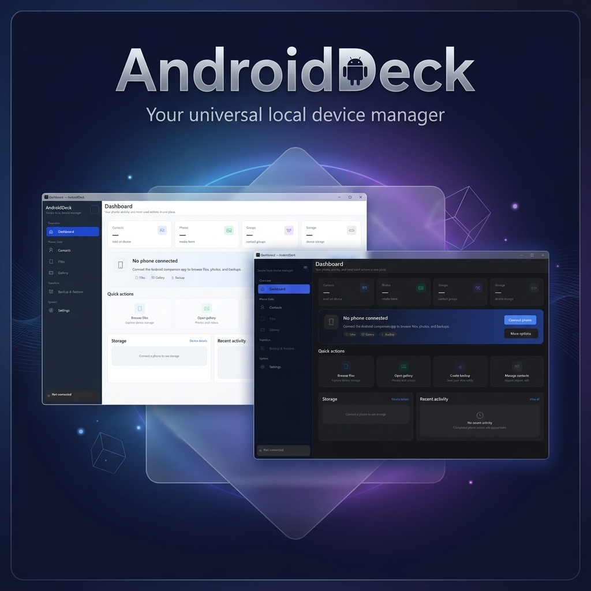

<div align="center">
  
</div>

# AndroidDeck

**Created by Walid Salameh**

AndroidDeck is a secure, local device manager that allows you to seamlessly manage, view, and edit your Android contacts, files, and media directly from your Windows PC. It consists of a beautiful, premium Windows desktop application (WPF) and an Android companion app that communicate locally over your Wi-Fi network without relying on cloud services.

## Features

### 📱 Live Phone Connection
- Connect your Android phone to your PC wirelessly.
- High-performance, local Wi-Fi synchronization.
- Secure, encrypted communication using HMAC and TLS-pinning (TOFU).

### 👥 Advanced Contact Management
- **Live Sync**: Edit contacts on your PC and watch them update on your phone instantly.
- **Full CRUD**: Create, read, update, and delete contacts on your Android device from Windows.
- **Smart Enrichment**: Loads basic details instantly, and fetches high-resolution photos and full details in the background.
- **VCF Support**: Also functions as a robust offline VCF (vCard) editor to import, export, and manage backup files.

### 🎨 Premium User Interface
- Modern, glass-morphism inspired design with sleek dark mode aesthetics.
- Responsive, virtualized lists capable of handling thousands of contacts smoothly.
- Fluid animations and real-time state updates.

## Architecture

AndroidDeck is split into two components that communicate via a local REST API:

1. **Windows App (AndroidDeck)**: A .NET 10 WPF application using the MVVM pattern (`CommunityToolkit.Mvvm`).
2. **Android Companion App (AndroidCompanion)**: A lightweight, headless Android service built with Kotlin and Ktor that exposes device data to the authorized PC.

## How to Use

### 1. Install the Android Companion App
1. Build the APK located in the `AndroidCompanion` folder or install the provided `app-debug.apk`.
2. Install it on your Android device.
3. Open the app and grant the necessary permissions (Contacts, Storage, etc.).
4. Start the server within the app. Note the IP address and pairing code displayed.

### 2. Run the Windows Desktop App
1. Open the solution in Visual Studio or build it via the .NET CLI.
2. Run the `AndroidDeck` application.
3. On the Dashboard, click **Connect Phone**.
4. Enter the IP address and the pairing code provided by the Android app.
5. Once paired, navigate to the **Contacts** tab to view your live Android contacts.

### 3. Managing Contacts
- **View**: Scroll through your contacts. Click any contact to view full details including their high-resolution photo.
- **Edit**: Double-click a contact or click the Edit button to modify names, phone numbers, emails, and organization details. Changes are saved back to the phone automatically.
- **Search & Filter**: Use the top search bar to instantly filter by name, phone number, or organization.
- **VCF Mode**: Disconnect the phone to switch to local file mode, where you can open, edit, and save standard `.vcf` files.

## Building from Source

### Prerequisites
- **Windows**: .NET 10 SDK, Visual Studio 2022 (recommended).
- **Android**: Android Studio, JDK 17, Android SDK.

### Build Windows App
```powershell
# From the root directory
dotnet build AndroidDeck.csproj
dotnet run --project AndroidDeck.csproj
```

### Build Android App
```powershell
# From the AndroidCompanion directory
.\gradlew assembleDebug
```

## Security & Privacy
AndroidDeck is designed for privacy. Your contacts and files never leave your local network. The pairing process generates a secure token, and all API calls require HMAC authentication, ensuring that only your paired PC can access the data on your phone.

## License
This project is licensed under the MIT License - see the [LICENSE](LICENSE) file for details.

Permission is hereby granted, free of charge, to any person obtaining a copy of this software and associated documentation files (the "Software"), to deal in the Software without restriction, including without limitation the rights to use, copy, modify, merge, publish, distribute, sublicense, and/or sell copies of the Software, and to permit persons to whom the Software is furnished to do so, subject to the following conditions:

The above copyright notice and this permission notice shall be included in all copies or substantial portions of the Software.

THE SOFTWARE IS PROVIDED "AS IS", WITHOUT WARRANTY OF ANY KIND, EXPRESS OR IMPLIED, INCLUDING BUT NOT LIMITED TO THE WARRANTIES OF MERCHANTABILITY, FITNESS FOR A PARTICULAR PURPOSE AND NONINFRINGEMENT. IN NO EVENT SHALL THE AUTHORS OR COPYRIGHT HOLDERS BE LIABLE FOR ANY CLAIM, DAMAGES OR OTHER LIABILITY, WHETHER IN AN ACTION OF CONTRACT, TORT OR OTHERWISE, ARISING FROM, OUT OF OR IN CONNECTION WITH THE SOFTWARE OR THE USE OR OTHER DEALINGS IN THE SOFTWARE.